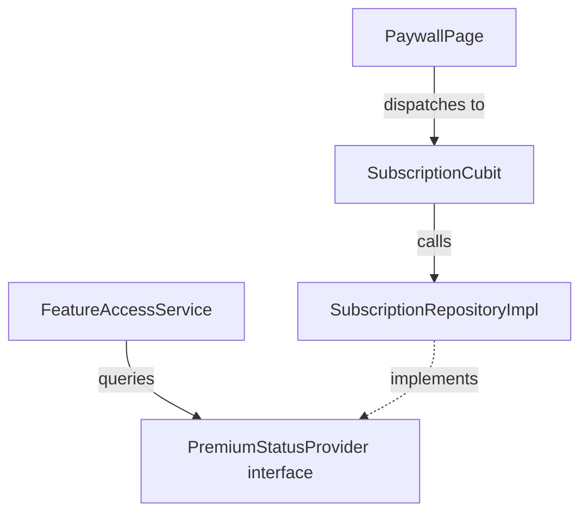

# Architecture Documentation — AnuMealAI

## 🏛️ Architectural Principles

AnuMealAI is built using **Clean Architecture** with a strict layer separation:

1. **Presentation Layer (`presentation/`)**:
   - Uses `Bloc` / `Cubit` for state management with immutable states extending `Equatable`.
   - UI widgets consume state via `BlocBuilder` and `BlocConsumer`.
   - Navigation is handled through declarative `GoRouter` with `StatefulShellRoute.indexedStack`.

2. **Domain Layer (`domain/`)**:
   - Contains pure Dart Entities and business logic (e.g. `RecipeMatchCalculator`).
   - Defines abstract Repository contracts (`IngredientRepository`, `RecipeRepository`, `MealPlannerRepository`, `SubscriptionRepository`).
   - Completely decoupled from Flutter, HTTP clients, and persistence mechanisms.

3. **Data Layer (`data/`)**:
   - Contains Models that convert between domain entities and serialized Map/JSON structures.
   - Local Data Sources persist models into isolated **Hive** boxes (`Hive.box<Map>`).
   - Remote Data Sources handle API communication via **Dio** and **RevenueCat SDK**.

---

## 🔒 Subscription & Inversion of Control

To avoid circular dependencies between `core/` and `features/subscription/`:
- `lib/core/services/premium_status_provider.dart` defines a clean interface (`isPremium`, `premiumChanges`).
- `SubscriptionRepositoryImpl` implements `PremiumStatusProvider`.
- `FeatureAccessService` checks daily limits and premium status without directly importing subscription presentation or data classes.

---

## 🗄️ Persistence Scheme (Hive & SharedPreferences)

| Key / Box Name | Purpose | Implementation |
|---|---|---|
| `anumeal_ingredients` | Stored pantry ingredients & availability status | `Hive.box<Map>` |
| `anumeal_recipes_cache` | Cached recipe suggestions & offline templates | `Hive.box<Map>` |
| `anumeal_favorites` | User favorite recipes | `Hive.box<Map>` |
| `anumeal_shopping_list` | Shopping list items & completion status | `Hive.box<Map>` |
| `anumeal_meal_plans` | 7-day weekly meal plans & slot assignments | `Hive.box<Map>` |
| `anumeal_meal_feedback` | User meal ratings and feedback history | `Hive.box<Map>` |
| `pref_user_preferences` | User profile, dietary choices, cuisines, skill level | `SharedPreferences` |
| `pref_recipe_gen_count_*` | Daily rate limiting counter for free-tier users | `SharedPreferences` |
| `pref_cooking_streak` | Cooking streak days and streak tracker | `SharedPreferences` |

---

## 🤖 AI Resilience Strategy

1. **Remote LLM Service (`RemoteAIRecipeService`)**: Calls external AI endpoint (Gemini / OpenAI / Custom Proxy) with structured JSON output when internet is available and API key is present.
2. **Local Algorithmic Generator (`LocalRecipeGenerator`)**: When offline, unconfigured, or if the network request fails/times out, the app deterministically generates rich recipes from bundled curated template assets (`assets/data/recipe_templates.json`).
3. **Resilient AI Service (`ResilientAIRecipeService`)**: Transparently intercepts all recipe requests, executes the fallback strategy, and guarantees the app **never crashes** due to API outages.
