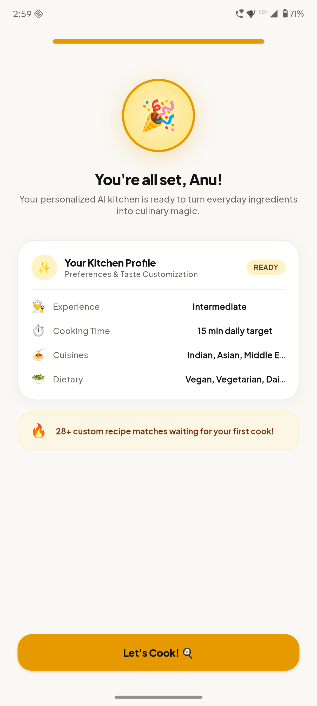
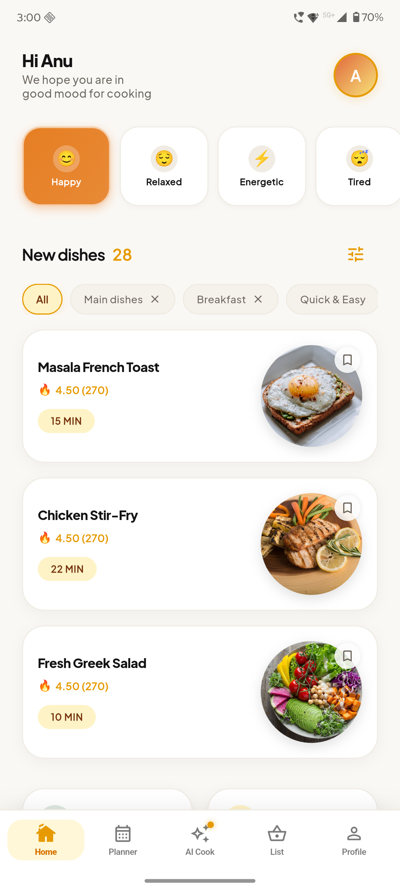
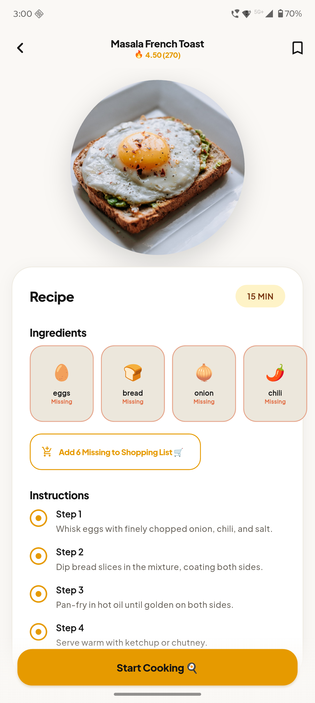
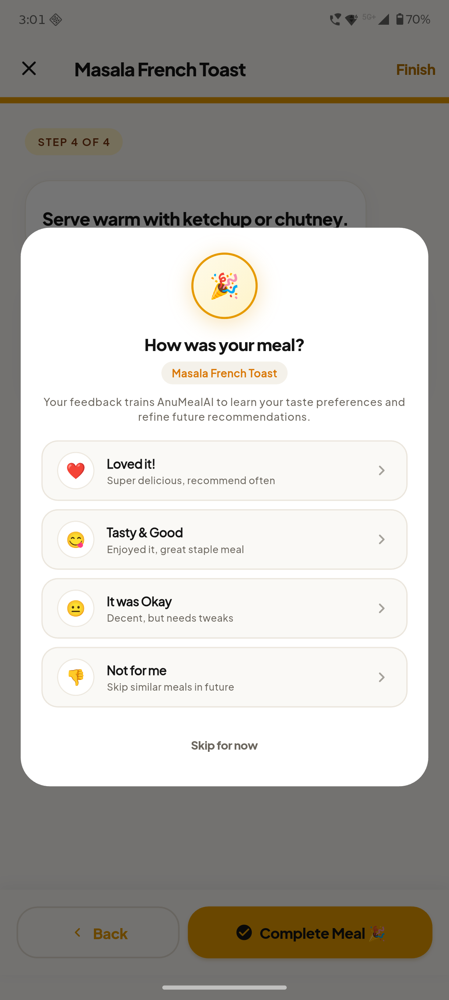
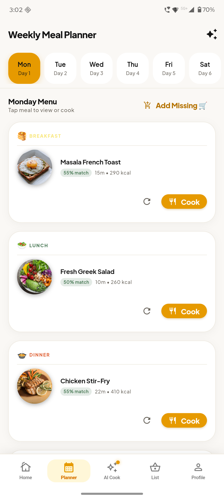
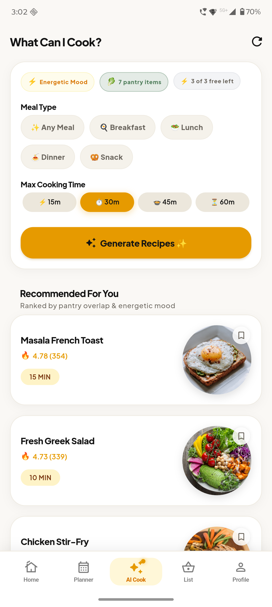
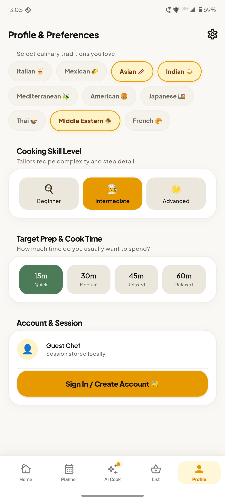
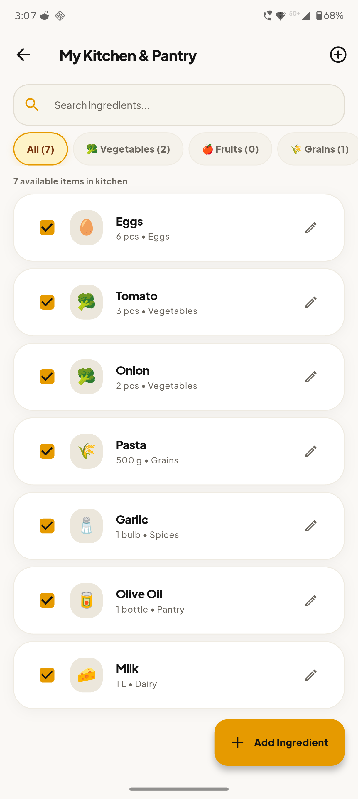

# AnuMealAI — AI Mood-Based Meal Planner & Smart Culinary Assistant 🍳✨

> **"Your mood. Your ingredients. Your perfect meal."**

AnuMealAI is a production-grade, offline-resilient Flutter application for Android and iOS. It intelligently curates chef-level recipes, manages weekly meal schedules, and matches pantry items based on what ingredients you already have and how you are feeling right now.

[](https://flutter.dev)
[](https://dart.dev)
[](https://ai.google.dev/)
[](https://firebase.google.com/)
[](https://www.revenuecat.com/)
[](https://flutter.dev)

---

## 📱 App Screenshot Showcase

| 🏠 Home & Mood Discovery | 🎭 Emotional Mood Selector | 🥑 Pantry Ingredient Matcher | 🍳 AI Recipe Generation |
| :---: | :---: | :---: | :---: |
|  |  |  |  |

| 📖 Step-by-Step Recipe Details | 📅 7-Day AI Meal Planner | 🛒 Categorized Shopping List | 👑 AnuMealAI Pro Paywall |
| :---: | :---: | :---: | :---: |
|  |  |  |  |

---

## 🌟 Key Features

### 1. 🎭 Mood-First Culinary Intelligence
* **6 Emotional Personas**: *Energetic* ⚡, *Cozy* 🛋️, *Adventurous* 🌶️, *Focused* 🧠, *Light & Fresh* 🥗, *Indulgent* 🍰.
* **Macronutrient Optimization**: High-protein for Energetic, comfort carbs for Cozy, omega-3s for Focused.
* **Real-Time Mood Switching**: Instant dashboard updates and curated suggestions.

### 2. 🥦 Smart Pantry Matcher ("What Can I Cook?")
* **Pantry Inventory Tracker**: Categorized ingredient selection across *Produce, Proteins, Dairy, Grains, Pantry Staples, and Spices*.
* **Pantry Match Percentage**: Computes exact ingredient overlap (e.g., `100% Match`, `85% Match`) to minimize household food waste.
* **Missing Ingredient Extraction**: Instant 1-tap addition of missing ingredients directly to your Shopping List.

### 3. 🤖 Google Gemini AI Live Recipe Generator
* **Google Gemini Engine**: Direct integration with Google Gemini models (`gemini-3.6-flash`).
* **Complete Nutritional Breakdown**: Calories, Protein, Carbs, Fats, cooking difficulty, and time estimates.
* **100% Offline Resilient Fallback**: Zero-downtime architecture automatically uses the built-in local recipe engine when offline or rate-limited.
* **Performance Shield**: In-flight request deduplication and 5-minute memory caching for instant loads with zero API waste.

### 4. 📅 7-Day AI Meal Planner & Customizer
* **Full-Week Scheduling**: Automated breakfast, lunch, dinner, and snack planning customized to your goals.
* **Slot Swapping**: Replace any meal slot with an alternative recipe without regenerating the entire week.
* **Cooking Progress Tracker**: Interactive check-offs and cooked streak tracking.
* **Dietary & Cuisine Filters**: Vegetarian, Vegan, Keto, Gluten-Free, Dairy-Free, Mediterranean, Asian, Italian, and more.

### 5. 🛒 Smart Categorized Shopping List
* **1-Tap Ingredient Sync**: Adds missing items from recipes and meal plans directly to your list.
* **Aisle Auto-Sorting**: Organizes items into *Produce, Dairy, Meat/Seafood, Bakery, Pantry, Spices, and Other*.
* **Interactive Checklist**: Strike-through items with instant clearing and quantity editing.

### 6. 💳 Monetization, Subscriptions & On-Theme Customer Center
* **RevenueCat Engine**: Fully integrated Google Play Billing & Apple StoreKit with auto-renewing subscriptions.
* **On-Theme Customer Center**:
  * Restore past Google Play / App Store transactions.
  * Direct one-tap store subscription management (cancel, change tier, update payment methods).
  * Store billing inquiries and legal links (*Privacy Policy*, *Terms of Service*).
* **Reviewer / Promo Code Passes**: Built-in promo validation (`SHIPATON2026`, `JUDGE_ACCESS`, `ANUMEALPRO`) for instant full-access testing.

### 7. ☁️ Firebase Authentication, Cloud Sync & Remote Config
* **Frictionless Anonymous Guest Mode**: Jump straight into the app with zero forced login barriers.
* **Firebase Multi-Device Backup**: Sign in with Email/Password to sync pantry, meal plans, and favorites via Cloud Firestore.
* **Dynamic Cloud Management**: Upgrade Gemini API keys, change AI models, toggle feature flags, and adjust free-tier quotas remotely over-the-air.

---

## 🏛️ Clean Architecture & Tech Stack

```
lib/
├── core/                         # Enterprise Infrastructure Layer
│   ├── constants/                # AppConfig, RemoteConfigKeys, SubscriptionConfig
│   ├── dependency_injection/     # GetIt service locator container
│   ├── errors/                   # Failure & Exception classes
│   ├── network/                  # Dio HTTP client & NetworkInfo
│   ├── router/                   # GoRouter navigation & deep linking
│   ├── services/                 # Firebase, RevenueCat, AI, Versioning, Analytics
│   ├── theme/                    # Obsidian Gold (Dark) & Gourmet Porcelain (Light)
│   └── widgets/                  # Reusable luxury UI components
└── features/                     # Domain-Driven Feature Modules (Clean Architecture)
    ├── auth/                     # Authentication & Guest session state machine
    ├── favorites/                # Saved recipes & offline Hive persistence
    ├── home/                     # Mood carousel & discovery dashboard
    ├── ingredients/              # Pantry inventory & tracking
    ├── legal/                    # Terms, Privacy & Account Deletion compliance
    ├── meal_planner/             # 7-day adaptive planner & slot swapping
    ├── mood/                     # Mood selection state machine
    ├── onboarding/               # Culinary preference questionnaire
    ├── profile/                  # User profile & dietary customization
    ├── recipes/                  # Match engine, cooking mode & Gemini AI
    ├── remote_config/            # Remote config entity & maintenance guard
    ├── settings/                 # Appearance, purchases & legal settings
    ├── shopping_list/            # Aisle-sorted grocery checklist
    └── subscription/             # Paywall, RevenueCat & Customer Center
```

---

## 🚀 Getting Started

### Prerequisites
* **Flutter SDK**: `3.24.0` or higher
* **Dart SDK**: `3.5.0` or higher
* **Android Studio / Xcode** (for device simulators & builds)

### Installation
```bash
# 1. Clone the repository
git clone https://github.com/anumealai/anu_meal_ai.git
cd anu_meal_ai

# 2. Fetch Flutter packages
flutter pub get

# 3. Verify static analysis
dart analyze lib

# 4. Run automated test suite
flutter test

# 5. Launch debug app
flutter run
```

---

## 🧪 Testing Suite

AnuMealAI includes a comprehensive test suite with **39/39 Passing Tests** verifying:
* Feature access and daily/weekly free quota enforcement.
* In-app purchase & promo code unlock flows.
* Resilient Gemini AI fallback and JSON parsing.
* Semantic version comparison engine (`1.0.9 < 1.0.10`).
* Authentication state machine and cloud synchronization.
* Pantry overlap and match percentage algorithms.

```bash
flutter test
```

---

## 📦 Building Production Release Binaries

### Android App Bundle (`.aab` for Google Play Console)
```bash
flutter build appbundle
```
* **Output Path**: `build/app/outputs/bundle/release/app-release.aab`

### Android Release APK (`.apk` for Direct Testing)
```bash
flutter build apk --release
```
* **Output Path**: `build/app/outputs/flutter-apk/app-release.apk`

---

## 📄 Documentation & Setup Guides

* [Architecture & Design System](ARCHITECTURE.md)
* [Firebase Console Setup](FIREBASE_SETUP.md)
* [RevenueCat In-App Purchases Setup](REVENUECAT_SETUP.md)
* [Remote Config & Dynamic Feature Flags](REMOTE_CONFIG_SETUP.md)
* [Firestore Security Rules](FIRESTORE_SECURITY_RULES.md)
* [Legal & Compliance Documents](LEGAL_DOCUMENTS.md)
* [Google Play Release Checklist](GOOGLE_PLAY_COMPLIANCE_CHECKLIST.md)

---

## ⚖️ License & Legal

* **Terms of Use**: [https://sites.google.com/view/anumealai-terms-of-use/home](https://sites.google.com/view/anumealai-terms-of-use/home) (or [https://anumealai.app/terms](https://anumealai.app/terms))
* **Privacy Policy**: [https://sites.google.com/view/anumealai-privacy-policy/home](https://sites.google.com/view/anumealai-privacy-policy/home) (or [https://anumealai.app/privacy](https://anumealai.app/privacy))
* Built for **Shipaton 2026** 🏆.
